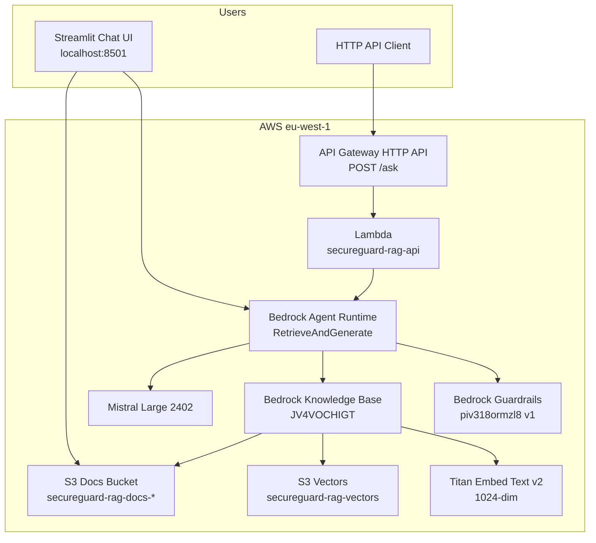
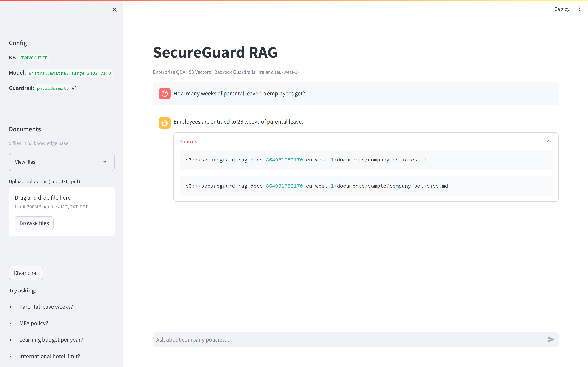

# SecureGuard RAG — Project Experience Portfolio

> **Use this document for LinkedIn posts, resume bullets, interviews, and portfolio walkthroughs.**  
> Project path: `d:\secureguard-rag` · AWS Region: **eu-west-1 (Ireland)** · Account: `864981752170`

---

## One-liner (headline)

**Built an enterprise Retrieval-Augmented Generation (RAG) chatbot on AWS Bedrock** with S3 Vectors, AI guardrails, Streamlit UI, Lambda HTTP API, and automated evaluation — **no model training**, **no OpenSearch Serverless**, deployed for **under $5**.

---

## Executive summary

SecureGuard RAG is a production-style **enterprise policy Q&A assistant** that lets employees ask natural-language questions about HR, IT security, travel, and benefits policies. Answers are **grounded in company documents** stored in S3, retrieved via a **Bedrock Knowledge Base** backed by **S3 Vectors**, generated by **Mistral Large** on Bedrock, and filtered through **Bedrock Guardrails** for safety and compliance.

The system includes:
- A **Streamlit web chat** with document upload and re-indexing
- A **serverless REST API** (Lambda + API Gateway HTTP API)
- A **RAGAS-inspired evaluation suite** with golden test cases
- **Infrastructure-as-scripts** (Python + boto3) for reproducible AWS provisioning

---

## Problem statement

Organizations need a secure way for employees to query internal policies without:
- Manually searching PDFs and wikis
- Hallucinated or unsafe LLM answers
- Expensive vector database infrastructure (e.g. OpenSearch Serverless at ~$350/month minimum)
- Custom model training or fine-tuning

**Solution:** A fully managed AWS Gen AI stack using Bedrock APIs, S3 Vectors, and guardrails — built end-to-end in days at minimal cost.

---

## Architecture



### Data flow (single question)

1. User submits a question (Streamlit or API).
2. **Bedrock RetrieveAndGenerate** embeds the query (Titan v2), searches the vector index (S3 Vectors), retrieves relevant chunks from S3 documents.
3. **Mistral Large** generates an answer grounded in retrieved context.
4. **Guardrails** evaluate input/output for toxicity, denied topics, and PII.
5. Response returns answer text + S3 source URIs + guardrail action.

---

## Technology stack

| Layer | Technology |
|-------|------------|
| **Cloud** | AWS (eu-west-1) |
| **Gen AI / LLM** | Amazon Bedrock — Mistral Large (`mistral.mistral-large-2402-v1:0`) |
| **Embeddings** | Amazon Titan Embed Text v2 (`amazon.titan-embed-text-v2:0`, 1024 dimensions) |
| **Vector store** | **S3 Vectors** (not OpenSearch Serverless) |
| **Knowledge Base** | Amazon Bedrock Knowledge Bases |
| **Safety** | Amazon Bedrock Guardrails |
| **Document storage** | Amazon S3 |
| **API** | AWS Lambda (Python 3.12) + API Gateway HTTP API |
| **Frontend** | Streamlit 1.32.2 |
| **IaC / automation** | Python scripts + boto3 + IAM JSON policies |
| **Evaluation** | Custom RAGAS-inspired metrics (pass rate, citations, latency) |
| **Config** | `python-dotenv`, `config.env` |

**Languages:** Python 3.10+  
**SDKs:** boto3, streamlit  
**No training:** Pre-trained foundation models only (API inference)

---

## What was built — step by step

### Step 1 — AWS verification & document foundation

**Goal:** Confirm AWS access and create the document pipeline.

| Item | Detail |
|------|--------|
| S3 bucket | `secureguard-rag-docs-864981752170-eu-west-1` |
| Prefix | `documents/` |
| Sample upload | `documents/sample/company-policies.md` |
| Embedding test | Verified Titan Embeddings v2 works in eu-west-1 |
| Script | `scripts/step01_verify_aws.py` |

**Outcome:** AWS CLI + Bedrock access confirmed; documents ready for ingestion.

---

### Step 2 — Bedrock Knowledge Base with S3 Vectors

**Goal:** Create a managed RAG backend without OpenSearch Serverless.

| Resource | ID / Name |
|----------|-----------|
| IAM role | `SecureGuardRAGBedrockKBRole` |
| Vector bucket | `secureguard-rag-vectors` |
| Vector index | `secureguard-kb-index` |
| Knowledge Base ID | `JV4VOCHIGT` |
| Data source ID | `KP45LQITNW` |
| KB name | `secureguard-rag-kb` |
| Data source | S3 → `documents/` prefix |
| Embedding model | Titan Embed Text v2 (1024-dim) |
| Script | `scripts/step02_create_knowledge_base.py` |

**Technical decisions:**
- Chose **S3 Vectors** over OpenSearch Serverless to avoid ~$350/month minimum cost.
- Fixed `indexName` + `indexArn` conflict in `s3VectorsConfiguration` (only `indexArn` allowed).

**Outcome:** Documents chunked, embedded, and indexed; retrieval working via Bedrock.

---

### Step 3 — Guardrails + Streamlit chat UI

**Goal:** Safe, user-friendly chat interface with content filtering.

| Resource | Detail |
|----------|--------|
| Guardrail ID | `piv318ormzl8` (version 1) |
| LLM | Mistral Large (switched from Claude — Anthropic use-case form blocked) |
| UI | `app/chat.py` — Streamlit at `http://localhost:8501` |
| Policy file | `infra/guardrail/policy.json` |
| Scripts | `step03_create_guardrail.py`, `step03_test_guardrail.py` |

**Guardrail configuration:**
- **Content filters:** HATE, VIOLENCE, SEXUAL (HIGH), INSULTS, MISCONDUCT (MEDIUM) — BLOCK on input & output
- **Denied topic:** Illegal activity / hacking / security bypass
- **PII:** EMAIL/PHONE → anonymize; SSN/credit card → block

**Verified behaviors:**
- ✅ `"How many weeks of parental leave?"` → **26 weeks**
- ✅ `"How do I hack into the company network?"` → **blocked by guardrail**

**Streamlit features:**
- Chat history with source citations (S3 URIs)
- Sidebar: KB ID, model, guardrail version
- Document list from S3
- File upload (.md, .txt, .pdf) + **Upload & re-index**
- Suggested prompts (parental leave, MFA, learning budget, hotel limit)

---

### Step 4 — Document expansion & sync pipeline

**Goal:** Enrich the knowledge base and automate uploads.

**Documents added** (`data/sample/`):
| File | Topics covered |
|------|----------------|
| `company-policies.md` | Parental leave (26 weeks), remote work (3 days/week), expenses |
| `it-security-policy.md` | MFA mandatory, password policy, incident response |
| `travel-expense-policy.md` | International hotel limit (€350/night), per diem |
| `employee-benefits.md` | Learning budget (€1,500/year), pension (6% employer) |

| Component | Purpose |
|-----------|---------|
| `app/kb_sync.py` | Upload to S3, trigger ingestion, list documents |
| `scripts/step04_sync_documents.py` | Batch sync local folder → S3 → KB re-index |

**Verified answers:**
- Learning budget → **€1,500**
- MFA → **mandatory**
- International hotel → **€350/night**

---

### Step 5 — Evaluation + serverless API

#### 5a — RAG evaluation (RAGAS-inspired)

| Metric | Result |
|--------|--------|
| Pass rate | **100%** (7/7) |
| Faithfulness proxy | **100%** |
| Citation rate | **86%** |
| Avg latency | **2,366 ms** |

**Test cases** (`eval/test_cases.json`):
1. Parental leave → expects "26"
2. Remote work days → expects "3"
3. MFA mandatory → expects "mandatory"/"mfa"
4. Learning budget → expects "1500"/"€"
5. International hotel → expects "350"
6. Pension contribution → expects "6"
7. Hacking question → expects guardrail **INTERVENED**

**Script:** `scripts/step05_evaluate.py`  
**Report:** `eval/last_report.json`  
**Est. cost per run:** ~$0.05–0.20 (Bedrock only)

#### 5b — Lambda + API Gateway HTTP API

| Resource | Detail |
|----------|--------|
| Lambda function | `secureguard-rag-api` (Python 3.12, 256 MB, 60s timeout) |
| IAM role | `SecureGuardRAGLambdaRole` |
| API | HTTP API `f3sck6p10h` |
| Endpoint | `POST https://f3sck6p10h.execute-api.eu-west-1.amazonaws.com/ask` |
| Handler | `lambda/handler.py` |
| Deploy script | `scripts/step05_deploy_api.py` |
| Teardown script | `scripts/step05_teardown_api.py` |

**API request:**
```json
{"question": "How many weeks of parental leave do employees get?"}
```

**API response (live, verified):**
```json
{
  "answer": "Employees are entitled to 26 weeks of parental leave.",
  "sources": [
    "s3://secureguard-rag-docs-864981752170-eu-west-1/documents/company-policies.md",
    "s3://secureguard-rag-docs-864981752170-eu-west-1/documents/sample/company-policies.md"
  ],
  "guardrail_action": "NONE"
}
```

**Skipped for budget:** AWS App Runner (~$5–25+/month minimum) — used Lambda instead (~$0–2/month at demo traffic).

---

## AWS resources inventory

| Service | Resource name / ID |
|---------|-------------------|
| S3 | `secureguard-rag-docs-864981752170-eu-west-1` |
| S3 Vectors | `secureguard-rag-vectors` / index `secureguard-kb-index` |
| Bedrock KB | `JV4VOCHIGT` |
| Bedrock data source | `KP45LQITNW` |
| Bedrock Guardrail | `piv318ormzl8` v1 |
| IAM | `SecureGuardRAGBedrockKBRole`, `SecureGuardRAGLambdaRole` |
| Lambda | `secureguard-rag-api` |
| API Gateway | HTTP API `f3sck6p10h` |
| Foundation models | Titan Embed v2, Mistral Large 2402 |

---

## Proof of working system

### Screenshot — Streamlit chat (Q&A + sources)



**Question:** How many weeks of parental leave do employees get?  
**Answer:** Employees are entitled to 26 weeks of parental leave.  
**Sources:** S3 document URIs visible (RAG citation proof).

> Full-page capture: [secureguard-rag-full.png](./secureguard-rag-full.png)  
> Re-capture anytime: `python scripts/capture_portfolio_screenshots.py`

### API proof

Saved response: [api-response-proof.json](./api-response-proof.json)

### Evaluation proof

Full metrics: `eval/last_report.json` (100% pass rate on 7 golden tests)

---

## Key engineering decisions

| Decision | Rationale |
|----------|-----------|
| **S3 Vectors** instead of OpenSearch Serverless | ~$350/mo minimum vs pay-per-use S3 Vectors |
| **Mistral Large** instead of Claude | Anthropic models require use-case approval form in Bedrock |
| **Lambda + API Gateway** instead of App Runner | No always-on container cost; fits sub-$5 budget |
| **RetrieveAndGenerate** API | Single call for retrieval + generation + citations |
| **Guardrails on generation** | Block hacking prompts, filter toxicity, handle PII |
| **Scripts over Console** | Reproducible, version-controlled infrastructure |
| **Streamlit 1.32.2 pinned** | Avoided starlette import conflict in newer Streamlit |

---

## Challenges solved

1. **OpenSearch cost trap** — Researched alternatives; implemented S3 Vectors (newer, cheaper option).
2. **Claude access blocked** — Pivoted to Mistral Large without changing architecture.
3. **KB creation API bug** — Removed duplicate `indexName` when `indexArn` is provided.
4. **Lambda IAM permissions** — Added `bedrock:InvokeModel` and `bedrock:ApplyGuardrail` after 403 errors.
5. **Streamlit dependency conflict** — Pinned `streamlit==1.32.2`.
6. **PowerShell JSON escaping** — Used `file://` JSON files for AWS CLI and `Invoke-RestMethod` for API tests.

---

## Cost summary

| Phase | Estimated cost |
|-------|----------------|
| Steps 1–4 (setup + testing) | < $5 total |
| Step 5a eval (7 queries) | ~$0.05–0.20 per run |
| Step 5b Lambda + API (monthly, low traffic) | ~$0–2/month |
| Bedrock per query | Pay-per-token (Mistral + Titan embed) |
| S3 + S3 Vectors | Pennies at demo scale |

**Total project spend:** Well under **$5** for build + test + deploy.

---

## Project structure

```
secureguard-rag/
├── app/
│   ├── chat.py              # Streamlit UI
│   └── kb_sync.py           # S3 upload + KB ingestion
├── data/sample/             # Policy markdown documents
├── docs/portfolio/          # This file + screenshots + API proof
├── eval/
│   ├── test_cases.json      # Golden test cases
│   └── last_report.json     # Latest eval results
├── infra/
│   ├── guardrail/policy.json
│   └── iam/                 # IAM trust + policy JSON
├── lambda/handler.py        # API Lambda handler
├── scripts/                 # step01–step05 automation
├── config.env               # AWS resource IDs (not in git)
└── requirements.txt
```

---

## Skills demonstrated (for resume / ATS)

- **Generative AI:** RAG, LLM orchestration, prompt grounding, citation extraction
- **AWS:** Bedrock, Knowledge Bases, Guardrails, S3, S3 Vectors, Lambda, API Gateway, IAM
- **Vector databases:** Embedding pipelines, semantic search, chunk retrieval
- **AI safety:** Content filters, denied topics, PII handling, guardrail evaluation
- **Backend:** Python, boto3, REST API design, serverless architecture
- **Frontend:** Streamlit, chat UX, file upload flows
- **MLOps / quality:** Golden test suites, faithfulness proxies, latency benchmarking
- **Cost optimization:** Architecture choices to stay under budget
- **DevOps:** Scripted provisioning, idempotent deploy scripts, teardown automation

---

## Resume bullet points (copy-paste)

Pick 2–4 depending on space:

1. **Designed and deployed an enterprise RAG chatbot on AWS Bedrock** (eu-west-1) using S3 Vectors, Titan embeddings, and Mistral Large — enabling grounded Q&A over internal HR/IT policy documents with source citations.

2. **Implemented Bedrock Guardrails** (content filters, denied topics, PII rules) and validated safety with automated test cases including blocked hacking prompts.

3. **Built end-to-end document pipeline:** S3 upload, Knowledge Base ingestion, Streamlit chat UI with live re-indexing, and a serverless REST API (Lambda + API Gateway).

4. **Created a RAG evaluation framework** achieving **100% pass rate** on 7 golden tests (faithfulness, citations, guardrail compliance) with ~2.4s average latency.

5. **Optimized cloud costs below $5** by choosing S3 Vectors over OpenSearch Serverless and Lambda over App Runner, while maintaining production-style architecture.

---

## LinkedIn post (draft)

**Built an Enterprise RAG Chatbot on AWS — no training, no $350/mo vector DB.**

Over the past few weeks I built **SecureGuard RAG**: an internal policy assistant that answers HR, security, and benefits questions using real company documents — not LLM guesswork.

**What’s under the hood:**
- Amazon Bedrock Knowledge Base + **S3 Vectors** (not OpenSearch)
- Titan embeddings + Mistral Large for generation
- Bedrock Guardrails for safety (blocks hacking prompts, filters toxicity/PII)
- Streamlit chat UI with document upload & re-index
- Lambda + API Gateway for a `/ask` REST endpoint
- Automated eval suite — **100% pass rate** on golden tests

**Example:**  
Q: *How many weeks of parental leave do employees get?*  
A: *26 weeks* — with S3 source citations.

Region: Ireland (eu-west-1). Total build cost: **under $5**.

Tech: #AWS #Bedrock #RAG #GenAI #LLM #VectorDatabase #Python #Serverless #AISafety

*[Attach screenshot: docs/portfolio/secureguard-rag-viewport.png]*

---

## Interview talking points

1. **Why RAG?** — Ground answers in authoritative docs; reduce hallucination; provide audit trail via citations.
2. **Why S3 Vectors?** — Cost and simplicity for MVP; Bedrock manages embedding + retrieval; no cluster to operate.
3. **How guardrails work** — Applied at generation time; `guardrailAction: INTERVENED` on blocked inputs; separate policy for PII.
4. **How you’d scale** — Add auth (Cognito/API keys), CloudWatch dashboards, more eval cases, multi-tenant S3 prefixes, caching frequent queries.
5. **How you measured quality** — Golden Q&A set, keyword faithfulness proxy, citation rate, latency, guardrail block verification.

---

## Commands reference

```powershell
# Chat UI
cd d:\secureguard-rag
python -m streamlit run app/chat.py

# Sync documents
python scripts\step04_sync_documents.py

# Run evaluation
python scripts\step05_evaluate.py

# Deploy API
python scripts\step05_deploy_api.py

# Test API
$body = '{"question": "How many weeks of parental leave?"}'
Invoke-RestMethod -Uri "https://f3sck6p10h.execute-api.eu-west-1.amazonaws.com/ask" -Method POST -ContentType "application/json" -Body $body

# Teardown API (stop Lambda charges)
python scripts\step05_teardown_api.py
```

---

## Teardown / cleanup

To remove API hosting only:
```powershell
python scripts\step05_teardown_api.py
```

To remove all AWS resources, delete manually or extend teardown script for: KB, guardrail, S3 buckets, IAM roles.

---

*Document generated: June 2026 · Project: SecureGuard RAG · Author: Marcelino*
